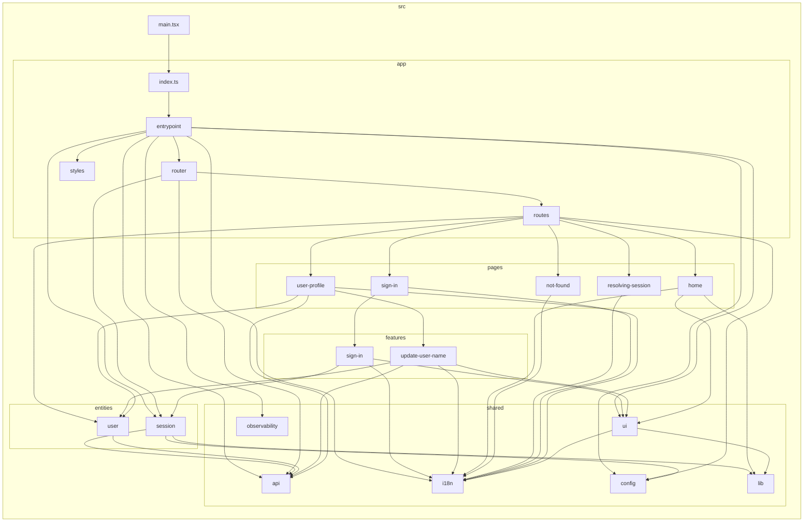

```mermaid
flowchart LR

subgraph 0["src"]
subgraph 1["app"]
2["entrypoint"]
3["index.ts"]
4["router"]
5["routes"]
6["styles"]
end
subgraph 7["entities"]
8["session"]
9["user"]
end
subgraph A["features"]
B["sign-in"]
C["update-user-name"]
end
D["main.tsx"]
subgraph E["pages"]
F["home"]
G["not-found"]
H["resolving-session"]
I["sign-in"]
J["user-profile"]
end
subgraph K["shared"]
L["api"]
M["config"]
N["i18n"]
O["lib"]
P["observability"]
Q["ui"]
end
end
2-->Q
2-->P
2-->8
2-->L
2-->N
2-->4
2-->6
2-->M
3-->2
4-->8
4-->L
4-->5
5-->G
5-->H
5-->9
5-->J
5-->F
5-->M
5-->I
8-->L
8-->M
8-->O
9-->L
B-->N
B-->8
B-->Q
C-->9
C-->L
C-->N
C-->Q
D-->3
F-->N
F-->O
F-->Q
G-->N
H-->N
I-->B
I-->N
J-->C
J-->N
J-->9
J-->L
Q-->O
Q-->N
```
