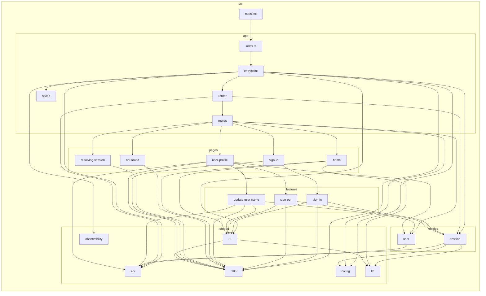

```mermaid
flowchart LR

subgraph 0["src"]
subgraph 1["app"]
2["entrypoint"]
3["index.ts"]
4["router"]
5["routes"]
6["styles"]
end
subgraph 7["entities"]
8["session"]
9["user"]
end
subgraph A["features"]
B["sign-in"]
C["sign-out"]
D["update-user-name"]
end
E["main.tsx"]
subgraph F["pages"]
G["home"]
H["not-found"]
I["resolving-session"]
J["sign-in"]
K["user-profile"]
end
subgraph L["shared"]
M["api"]
N["config"]
O["i18n"]
P["lib"]
Q["observability"]
R["ui"]
end
end
2-->R
2-->Q
2-->8
2-->M
2-->O
2-->4
2-->6
2-->N
3-->2
4-->8
4-->M
4-->5
5-->H
5-->I
5-->9
5-->K
5-->G
5-->N
5-->J
8-->M
8-->N
8-->P
9-->M
B-->O
B-->8
B-->R
C-->8
C-->O
C-->R
D-->9
D-->M
D-->O
D-->R
E-->3
G-->O
G-->P
G-->R
H-->O
I-->O
J-->B
J-->O
K-->C
K-->D
K-->O
K-->9
K-->M
R-->P
R-->O
```
