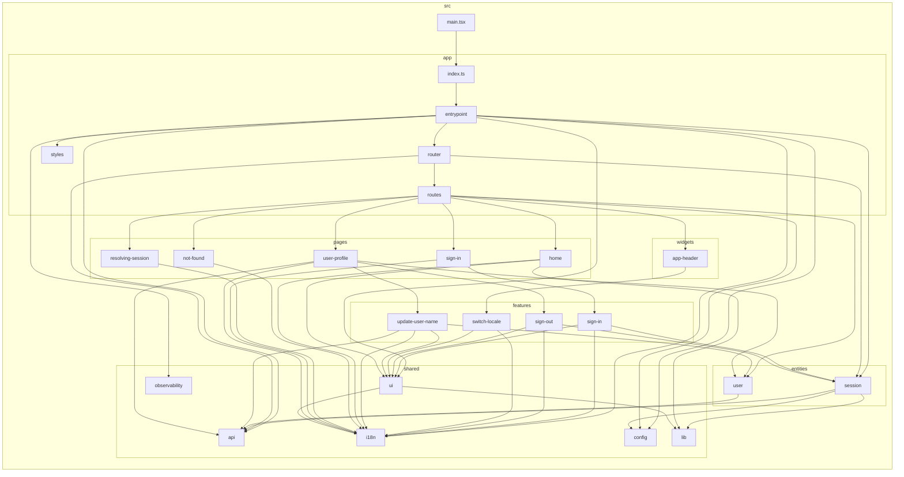

```mermaid
flowchart LR

subgraph 0["src"]
subgraph 1["app"]
2["entrypoint"]
3["index.ts"]
4["router"]
5["routes"]
6["styles"]
end
subgraph 7["entities"]
8["session"]
9["user"]
end
subgraph A["features"]
B["sign-in"]
C["sign-out"]
D["switch-locale"]
E["update-user-name"]
end
F["main.tsx"]
subgraph G["pages"]
H["home"]
I["not-found"]
J["resolving-session"]
K["sign-in"]
L["user-profile"]
end
subgraph M["shared"]
N["api"]
O["config"]
P["i18n"]
Q["lib"]
R["observability"]
S["ui"]
end
subgraph T["widgets"]
U["app-header"]
end
end
2-->S
2-->R
2-->8
2-->N
2-->P
2-->4
2-->6
2-->O
3-->2
4-->8
4-->N
4-->5
5-->I
5-->O
5-->U
5-->J
5-->9
5-->L
5-->H
5-->K
8-->N
8-->O
8-->Q
9-->N
B-->P
B-->8
B-->S
C-->8
C-->P
C-->S
D-->P
D-->S
E-->9
E-->N
E-->P
E-->S
F-->3
H-->P
H-->Q
H-->S
I-->P
J-->P
K-->B
K-->P
L-->C
L-->E
L-->P
L-->9
L-->N
S-->Q
S-->P
U-->D
```
