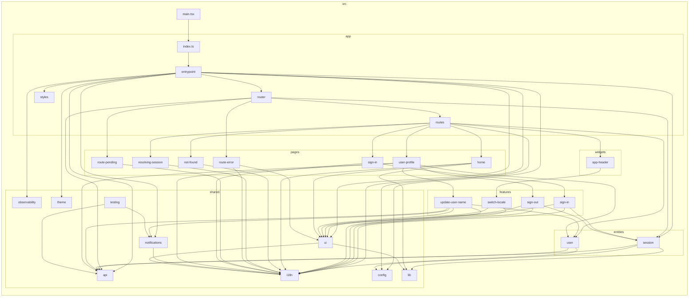

```mermaid
flowchart LR

subgraph 0["src"]
subgraph 1["app"]
2["entrypoint"]
3["index.ts"]
4["router"]
5["routes"]
6["styles"]
end
subgraph 7["entities"]
8["session"]
9["user"]
end
subgraph A["features"]
B["sign-in"]
C["sign-out"]
D["switch-locale"]
E["update-user-name"]
end
F["main.tsx"]
subgraph G["pages"]
H["home"]
I["not-found"]
J["resolving-session"]
K["route-error"]
L["route-pending"]
M["sign-in"]
N["user-profile"]
end
subgraph O["shared"]
P["api"]
Q["config"]
R["i18n"]
S["lib"]
T["notifications"]
U["observability"]
V["testing"]
W["theme"]
X["ui"]
end
subgraph Y["widgets"]
Z["app-header"]
end
end
2-->X
2-->U
2-->T
2-->8
2-->P
2-->R
2-->W
2-->4
2-->6
2-->Q
3-->2
4-->8
4-->P
4-->5
4-->L
4-->K
5-->I
5-->Q
5-->Z
5-->J
5-->9
5-->N
5-->H
5-->M
8-->P
8-->Q
8-->S
9-->P
9-->R
B-->R
B-->8
B-->X
C-->8
C-->R
C-->X
D-->R
D-->X
E-->R
E-->9
E-->P
E-->T
E-->X
F-->3
H-->R
H-->S
H-->X
I-->R
J-->R
K-->R
K-->X
L-->R
M-->B
M-->R
N-->C
N-->E
N-->R
N-->9
N-->P
T-->R
V-->P
V-->T
X-->S
X-->R
Z-->D
```
