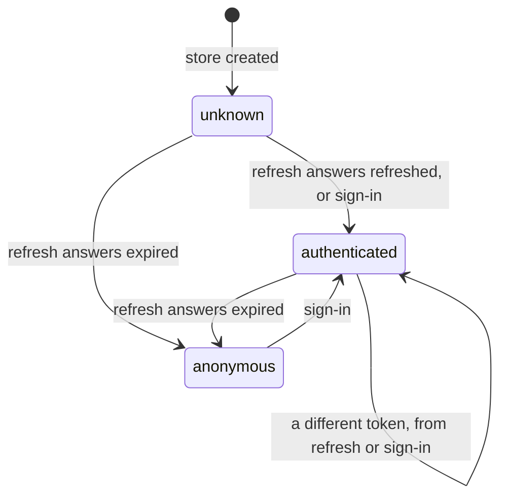

# Session management

> **Status:** Complete · **Layers:** app, entities, shared, outside layers · **Verified against:** `1c193c6`

## Purpose

The API trusts two credentials: a short-lived bearer access token sent with each request, and an
`httpOnly` refresh cookie — unreadable by any script — that buys a new access token. Session
management is the engine between the two: it tracks whether a session exists at all, keeps the
access token in memory, hands it to the authenticated HTTP client, and renews it when the API
rejects it. It runs at most one renewal at a time — one refresh per tab however many requests ask,
and one tab after another — because the backend rotates refresh tokens and, when a spent one is
presented again, revokes the whole token family, which ends that sign-in in every tab that shares
the cookie. When a session ends it empties the query cache, so data fetched under one session never
outlives it, and to everything above it a session is a status string, never a token.

## How it works

**Construction sends nothing.** `App` passes `appConfig.apiBaseUrl` to `AppProviders`, which builds
one _transport_ for the app's lifetime in a `useState` lazy initializer. Throughout this doc
**transport** means exactly one thing: the `AuthenticatedTransport` bundle
`createAuthenticatedTransport` returns — the authenticated HTTP client plus three _ports_, types
other code programs against without knowing which concrete implements them: `SessionObserver`,
`SessionResolver` and `SessionStarter` (the full interface is under
[Public surface → Types](#types)). The bundle is not the peer feature
[HTTP transport](./http-transport.md), which owns the `HttpClient` port, `createHttpClient` and the
interceptor mechanics that this bundle's two clients are built from; this doc covers only what the
session plugs into them. Behind the bundle the factory also wires a `SessionStore` (which starts in
`unknown`), an unauthenticated HTTP client, one `SessionApi` and a `SessionTokenSource` — none of
which it returns. `AppProviders` publishes the client, the resolver and the starter through React
providers and subscribes `clearCacheOnSessionEnd` to the observer in a `useEffect`
([Composition root](./composition-root.md) covers the provider tree). No request leaves until
something asks about the session.

**Two callers ask for a renewal, and both join one flight.** Navigating into the guarded subtree —
the routes under `src/app/routes/_authenticated/` — runs the guard's `beforeLoad`, which calls
`SessionResolver.resolve()`, which calls the token source's `settle()`
([Authenticated route guard](./route-guard.md)). A `401` on the authenticated client makes its
bearer interceptor call `renewToken(staleToken)` with the token the failed request carried
([HTTP transport](./http-transport.md)). Both end in the same _single-flight_ task — at most one run
at a time, with every caller that arrives meanwhile sharing its result — named by
`REFRESH_TASK_NAME`, `frontend-boilerplate:session-refresh`. Callers in one tab share its promise;
tabs of the same origin queue for a lock of that name from the browser's Web Locks API
(`navigator.locks`, a mutex shared by every tab of an origin).

**The refresh.** The task calls `SessionApi.refresh`, which posts an empty JSON object to
`{apiBaseUrl}/auth/refresh` — `POST /v1/auth/refresh` with the default base URL — through the
unauthenticated client; the only credential is the refresh cookie. The answer becomes a
`RefreshResult`: `refreshed`, carrying the `AccessToken` that `refreshSessionResponseDtoSchema`
validated and `toRefreshedAccessToken` mapped; `expired` when the endpoint answers `401`; or
`unavailable` for any other `HttpError` — another status, a network failure, a timeout, or a body
that fails the schema, an empty token included. The token source's `applyResult` then writes the
store: `refreshed` calls `store.start(accessToken)`, `expired` calls `store.end()`, and
`unavailable` changes nothing.

**Serving the token.** Before each request on the authenticated client, the interceptor calls
`getToken()`, which projects the token out of the current state with `readAccessToken` — `null`
while the session is `unknown` or `anonymous`, in which case the request goes out with no
`Authorization` header. After a `401`, `renewToken(staleToken)` decides whether a refresh is worth
a request:

| Store state when the `401` arrives                                                           | `renewToken` resolves to                                         |
| -------------------------------------------------------------------------------------------- | ---------------------------------------------------------------- |
| `anonymous`                                                                                  | `null` at once — no request                                      |
| A renewal is already running                                                                 | That renewal's result, whatever token the caller carried         |
| Holds exactly `staleToken` — including `unknown` after a bare request, where both are `null` | The result of a new single-flight refresh                        |
| Holds a different token                                                                      | That token, with no request — another caller has already renewed |

The interceptor then replays the request once or rejects with the original `401`. `settle()` is the
guard's variant: an `authenticated` or `anonymous` status is returned as it stands, without a
request, while `unknown` joins or starts the single flight and returns whatever status the store
holds afterwards.

Neither entry point touches the flight directly. Both go through `joinRenewal`, a private helper
inside `createSessionTokenSource` that awaits `renewal.run()` in a `try` / `catch` and answers
`null` when it rejects — so a refresh that rejects rather than resolving (a failure that is not an
`HttpError`, or a lock wait that timed out) reaches `renewToken` and `settle()` as "no token", never
as an exception.

**Failure paths.**

- _Expired._ A `401` from `/auth/refresh` moves the store to `anonymous`. The request that asked
  fails with its original `401`, and so does every later request, without another refresh:
  `renewToken` now returns `null` at once and `settle()` returns `anonymous`, so the guard sends the
  visitor to `/sign-in` on the next navigation into the guarded subtree. Only a sign-in leaves
  `anonymous` ([Sign-in](./sign-in.md)).
- _Unavailable._ The store keeps its state — it stays `unknown`, or keeps its current token. The
  request that asked fails with its `401`; a `settle()` from `unknown` returns `unknown`, which the
  guard treats as a denial; the next request or navigation tries again. A refresh that rejects
  instead of resolving takes the same path, because `joinRenewal` turns the rejection into `null`
  and no arm of `applyResult` ever runs, so the store is never written. This is what a fresh clone
  with no API sees: the refresh fails without a `401`, so it is `unavailable`, the session stays
  `unknown`, and `/users/$userId` redirects to `/sign-in`.

**Session end.** `store.end()` publishes `anonymous`. `clearCacheOnSessionEnd` remembers the
previous status and, on any notification that leaves `authenticated`, calls `queryClient.clear()`.



An `unavailable` refresh is not a transition: the state stays where it was.

## Architecture

In Feature-Sliced Design terms, `entities/session` is a _slice_ — one folder per business noun on a
layer — split into purpose-named _segments_: `model/` holds the state machine, the store and the
renewal policy and names no HTTP status code; `api/` holds the refresh call, its wire schema and its
mapper. It holds no TanStack Query option factory — the segment's other usual inhabitant, and what
`entities/user/api/` fills with `user-queries.ts` and `user-mutations.ts` — because nothing above
the slice renders a session, so there is nothing yet to query. Other layers import the slice only
through its _public API_, `src/entities/session/index.ts`. _Seam_ is this repo's other word for a
port: a type consumers program against while the concrete implementation is chosen elsewhere. This
feature's seams are `SessionObserver`, the read-only view of the status; `BearerTokenSource`, a
consumer-driven port that `shared/api` declares for its bearer interceptor and `SessionTokenSource`
implements; and, inside the slice, `SessionRenewalTarget` (a `Pick` of the store) plus the injected
`refresh: () => Promise<RefreshResult>`, so the renewal policy depends on neither the concrete
store nor HTTP. The concretes — `createSessionStore`, `createSessionApi`,
`createSessionTokenSource`, and `singleFlight` beneath the token source — meet in exactly one place:
`src/app/entrypoint/create-authenticated-transport.ts`, inside `app/entrypoint`
([Composition root](./composition-root.md)), the only place a client is constructed. `AppProviders`
owns the result's
lifetime. Imports point strictly downward — `app/entrypoint` → `entities/session` → `shared/api`,
`shared/config` and `shared/lib/single-flight` — and `eslint.config.js` rejects a session-constructor
import below `app` and in `app/routes` and `app/router`
([Architecture boundaries](./architecture-boundaries.md) documents the fences).

| Component                                                      | Layer                    | Responsibility                                                                                                      | File                                                   |
| -------------------------------------------------------------- | ------------------------ | ------------------------------------------------------------------------------------------------------------------- | ------------------------------------------------------ |
| `SessionState`, `SessionStatus`, `readAccessToken`             | entities/session · model | The three-state union, its status projection, and the pure token projection (`null` unless `authenticated`)         | `src/entities/session/model/session-state.ts`          |
| `AccessToken`, `toAccessToken`                                 | entities/session · model | The branded token type and the one function that mints it                                                           | `src/entities/session/model/access-token.ts`           |
| `RefreshResult`                                                | entities/session · model | The outcome of one refresh: `refreshed` (with the token), `expired` or `unavailable`                                | `src/entities/session/model/refresh-result.ts`         |
| `createSessionStore`, `SessionStore`                           | entities/session · model | In-memory, observable holder of the `SessionState`: `read`, `subscribe`, `start`, `end`                             | `src/entities/session/model/session-store.ts`          |
| `toSessionObserver`, `SessionObserver`                         | entities/session · model | The read-only view: `status()` and `subscribe()`, no token and no mutator                                           | `src/entities/session/model/session-store.ts`          |
| `createSessionTokenSource`, `SessionTokenSource`               | entities/session · model | Serves the token (`getToken`), decides and runs renewals (`renewToken`), bootstraps an `unknown` session (`settle`) | `src/entities/session/model/session-token-source.ts`   |
| `createSessionApi` (its `refresh`), `SessionWriteClient`       | entities/session · api   | Posts to `/auth/refresh` and classifies the answer into a `RefreshResult`                                           | `src/entities/session/api/session-api.ts`              |
| `refreshSessionResponseDtoSchema`, `RefreshSessionResponseDto` | entities/session · api   | The `zod/mini` wire schema of the refresh response: a non-empty `accessToken`                                       | `src/entities/session/api/session-dto.ts`              |
| `toRefreshedAccessToken`                                       | entities/session · api   | Maps the refresh DTO to an `AccessToken`                                                                            | `src/entities/session/api/session-mapper.ts`           |
| `singleFlight`                                                 | shared/lib               | Runs a task at most once at a time: one shared promise per tab, a Web Lock across tabs                              | `src/shared/lib/single-flight/single-flight.ts`        |
| `BearerTokenSource`                                            | shared/api               | The port the bearer interceptor calls; `SessionTokenSource` implements it                                           | `src/shared/api/bearer-token-source.ts`                |
| `attachBearerToken`                                            | shared/api               | The interceptors that send the token and renew once on a `401` ([HTTP transport](./http-transport.md))              | `src/shared/api/attach-bearer-token.ts`                |
| `appConfig.name`                                               | shared/config            | Namespace of the refresh lock                                                                                       | `src/shared/config/app-config.ts`                      |
| `createAuthenticatedTransport`, `AuthenticatedTransport`       | app/entrypoint           | Composes the two HTTP clients with the session collaborators; returns the client and three ports                    | `src/app/entrypoint/create-authenticated-transport.ts` |
| `clearCacheOnSessionEnd`, `CacheResetTarget`                   | app/entrypoint           | Clears the query cache on every transition out of `authenticated`                                                   | `src/app/entrypoint/clear-cache-on-session-end.ts`     |
| `AppProviders`                                                 | app/entrypoint           | Owns the transport's lifetime and subscribes the cache policy                                                       | `src/app/entrypoint/app-providers.tsx`                 |
| `SESSION_CONSTRUCTOR_NAMES`                                    | outside layers           | Lint fence that keeps the five session constructors out of lower layers and `app/routes` / `app/router`             | `eslint.config.js`                                     |
| `restoreSession`                                               | outside layers           | End-to-end stub that answers the refresh with a pinned token                                                        | `e2e/fixtures/session-stub.ts`                         |

## Public surface

Session management serves no route and renders nothing; it is infrastructure, consumed through
ports.

### The `@/entities/session` public API

Three documented features share this barrel. Every export is listed, with the doc that owns it. The
five `create*` factories are constructors: lint bans importing them below `app` and in `app/routes`
and `app/router`, so in practice only `app/entrypoint` calls them.

| Export                     | Kind      | Documented in                                            |
| -------------------------- | --------- | -------------------------------------------------------- |
| `createSessionStore`       | factory   | This doc                                                 |
| `toSessionObserver`        | function  | This doc                                                 |
| `SessionObserver`          | type      | This doc                                                 |
| `SessionStatus`            | type      | This doc                                                 |
| `createSessionTokenSource` | factory   | This doc                                                 |
| `createSessionApi`         | factory   | This doc (`refresh`); [Sign-in](./sign-in.md) (`signIn`) |
| `createSessionResolver`    | factory   | [Authenticated route guard](./route-guard.md)            |
| `SessionResolver`          | type      | [Authenticated route guard](./route-guard.md)            |
| `useSessionResolver`       | hook      | [Authenticated route guard](./route-guard.md)            |
| `SessionResolverProvider`  | component | [Authenticated route guard](./route-guard.md)            |
| `createSessionStarter`     | factory   | [Sign-in](./sign-in.md)                                  |
| `SessionStarter`           | type      | [Sign-in](./sign-in.md)                                  |
| `useSessionStarter`        | hook      | [Sign-in](./sign-in.md)                                  |
| `SessionStarterProvider`   | component | [Sign-in](./sign-in.md)                                  |
| `Credentials`              | type      | [Sign-in](./sign-in.md)                                  |
| `SignInOutcome`            | type      | [Sign-in](./sign-in.md)                                  |

### Types

The session's shape, from `model/session-state.ts` (the barrel exports only `SessionStatus`, the
union `'anonymous' | 'authenticated' | 'unknown'`):

```ts
export type SessionState =
  | { readonly status: 'anonymous' }
  | { readonly status: 'authenticated'; readonly accessToken: AccessToken }
  | { readonly status: 'unknown' };

export type SessionStatus = SessionState['status'];
```

The store, its read-only view and the narrow target the token source writes, from
`model/session-store.ts`:

```ts
export type SessionListener = () => void;

export interface SessionStore {
  readonly read: () => SessionState;
  readonly subscribe: (listener: SessionListener) => () => void;
  readonly start: (accessToken: AccessToken) => void;
  readonly end: () => void;
}

export interface SessionObserver {
  readonly status: () => SessionStatus;
  readonly subscribe: (listener: SessionListener) => () => void;
}

export type SessionRenewalTarget = Pick<SessionStore, 'end' | 'read' | 'start'>;
```

The bearer interceptor's port, from `shared/api/bearer-token-source.ts`, and the token source that
implements it, from `model/session-token-source.ts`. The interceptor calls `getToken` on every
request without a guard, so an implementation must never throw from it; it calls `renewToken`
through `renewQuietly` in `attach-bearer-token.ts` ([HTTP transport](./http-transport.md)), which
turns a rejection into "no token".

```ts
export interface BearerTokenSource {
  readonly getToken: () => string | null;
  readonly renewToken: (staleToken: string | null) => Promise<string | null>;
}

export interface CreateSessionTokenSourceOptions {
  readonly store: SessionRenewalTarget;
  readonly refresh: () => Promise<RefreshResult>;
}

export interface SessionTokenSource extends BearerTokenSource {
  readonly settle: () => Promise<SessionStatus>;
}
```

The refresh outcome and the API, from `model/refresh-result.ts` and `api/session-api.ts`
(`signIn` and `SignInResult` belong to [Sign-in](./sign-in.md)):

```ts
export type RefreshResult =
  | { readonly status: 'refreshed'; readonly accessToken: AccessToken }
  | { readonly status: 'expired' }
  | { readonly status: 'unavailable' };

export type SessionWriteClient = Pick<HttpClient, 'post'>;

export interface SessionApi {
  readonly refresh: () => Promise<RefreshResult>;
  readonly signIn: (credentials: Credentials) => Promise<SignInResult>;
}
```

The single-flight handle, from `shared/lib/single-flight/single-flight.ts` (not exported; callers
use the inferred type):

```ts
interface SingleFlightTask<TValue> {
  readonly run: () => Promise<TValue>;
  readonly isRunning: () => boolean;
}
```

The transport bundle itself — the `AuthenticatedTransport` that every "transport" in this doc means
— from `app/entrypoint/create-authenticated-transport.ts`, and the cache policy's target, from
`app/entrypoint/clear-cache-on-session-end.ts`:

```ts
export interface AuthenticatedTransport {
  readonly httpClient: HttpClient;
  readonly sessionObserver: SessionObserver;
  readonly sessionResolver: SessionResolver;
  readonly sessionStarter: SessionStarter;
}

export type CacheResetTarget = Pick<QueryClient, 'clear'>;
```

### Functions

| Function                       | Signature                                                                           | Reached through                              |
| ------------------------------ | ----------------------------------------------------------------------------------- | -------------------------------------------- |
| `createSessionStore`           | `(): SessionStore`                                                                  | `@/entities/session`                         |
| `toSessionObserver`            | `(store: SessionStore): SessionObserver`                                            | `@/entities/session`                         |
| `createSessionTokenSource`     | `(options: CreateSessionTokenSourceOptions): SessionTokenSource`                    | `@/entities/session`                         |
| `createSessionApi`             | `(unauthenticatedClient: SessionWriteClient): SessionApi`                           | `@/entities/session`                         |
| `readAccessToken`              | `(state: SessionState): AccessToken \| null`                                        | Slice-internal                               |
| `toAccessToken`                | `(value: string): AccessToken`                                                      | Slice-internal                               |
| `toRefreshedAccessToken`       | `(dto: RefreshSessionResponseDto): AccessToken`                                     | Slice-internal                               |
| `singleFlight`                 | `<TValue>(taskName: string, task: () => Promise<TValue>): SingleFlightTask<TValue>` | `@/shared/lib/single-flight`                 |
| `createAuthenticatedTransport` | `(baseUrl: string): AuthenticatedTransport`                                         | Its module in `app/entrypoint` (not `@/app`) |
| `clearCacheOnSessionEnd`       | `(session: SessionObserver, cache: CacheResetTarget): () => void`                   | Its module in `app/entrypoint` (not `@/app`) |

### The refresh exchange

| Aspect        | Contract                                                                                                                                             |
| ------------- | ---------------------------------------------------------------------------------------------------------------------------------------------------- |
| Request       | `POST {apiBaseUrl}/auth/refresh` (`REFRESH_SESSION_PATH`), JSON body `{}`, through the unauthenticated client                                        |
| Credential    | The `httpOnly` refresh cookie only; the request carries no `Authorization` header                                                                    |
| `200`         | Body validated by `refreshSessionResponseDtoSchema` — `{ accessToken: string }`, non-empty — then `refreshed`                                        |
| `401`         | `expired`: the session is over                                                                                                                       |
| Anything else | `unavailable` for every other `HttpError` (another status, `network`, `timeout`, or `validation` on a malformed body); a non-`HttpError` is rethrown |

### Internal by design

`SessionState`, `SessionStore`, `SessionListener`, `SessionRenewalTarget`, `readAccessToken`,
`AccessToken`, `toAccessToken`, `RefreshResult`, `SessionTokenSource`,
`CreateSessionTokenSourceOptions`, `SessionApi`, `SessionWriteClient`, the refresh DTO, its schema
and its mapper stay inside the slice. No module outside it can name a token-carrying type, a mutator
or the wire shape; `create-authenticated-transport.ts` holds the store and the token source only by
inference, and they never leave that factory.

## Configuration

| Variable / option                                                          | Default                                                  | Meaning                                                                                                                                                             |
| -------------------------------------------------------------------------- | -------------------------------------------------------- | ------------------------------------------------------------------------------------------------------------------------------------------------------------------- |
| `VITE_API_BASE_URL`, read into `appConfig.apiBaseUrl`                      | `/v1` (a blank or whitespace-only value also falls back) | Base URL of both clients; the refresh goes to `{base}/auth/refresh`. Keep the `/v1` prefix — see below                                                              |
| `appConfig.name`                                                           | `'frontend-boilerplate'`                                 | Namespace of the Web Lock: `REFRESH_TASK_NAME` is `frontend-boilerplate:session-refresh`                                                                            |
| `AppProviders` `apiBaseUrl` prop → `createAuthenticatedTransport(baseUrl)` | `appConfig.apiBaseUrl`, passed by `app.tsx`              | The base URL both clients share, read once in the `useState` initializer; a later prop change does not rebuild the transport                                        |
| `sendCookies` on the unauthenticated client                                | `true` (`createHttpClient` defaults it to `false`)       | Sets axios `withCredentials`, which lets `/auth/refresh` and `/auth/login` send and receive the refresh cookie even when the API is another origin of the same site |
| `bearerTokenSource` on the authenticated client                            | The `SessionTokenSource`                                 | Attaches `Authorization: Bearer <token>` and the renew-once-on-`401` replay                                                                                         |
| `LOCK_TIMEOUT_MILLISECONDS` (constant, `single-flight.ts`)                 | `20_000`                                                 | Longest a tab waits to acquire the lock before its renewal counts as failed                                                                                         |
| `DEFAULT_TIMEOUT_MILLISECONDS` (constant, `http-client.ts`)                | `15_000`                                                 | Bounds each refresh request; neither client overrides `timeoutMilliseconds`                                                                                         |
| `server.proxy` in `vite.config.ts`                                         | `'/v1': 'http://localhost:8000'`                         | Keeps every request same-origin in development                                                                                                                      |
| `webServer.env` in `playwright.config.ts`                                  | `VITE_API_BASE_URL: API_PREFIX` (`/v1`)                  | The base URL of the production build the end-to-end suite runs against                                                                                              |

`VITE_API_BASE_URL` is read only by `src/shared/config/app-config.ts`
([Configuration and environment](./configuration.md)). Three deployment rules follow from the
refresh cookie, which backend-boilerplate issues `httpOnly`, with `sameSite: 'strict'` and
`path: '/v1/auth'` (`src/presentation/http/cookies.ts` in that repository):

- **Keep the `/v1` prefix in the base URL.** The browser matches the cookie's `path` against the
  URL it sends to. A base URL whose public path is not `/v1` — a proxy that maps `/api` onto the
  backend's `/v1`, say — sends the refresh without the cookie; the backend answers `401`, and this
  engine reads that as `expired`, so the misconfiguration looks exactly like every session expiring.
- **Serve the API on the same site as the app.** A `sameSite: 'strict'` cookie is never sent on a
  cross-site request, and `withCredentials` cannot override that. If the API must live on another
  registrable domain, change the backend's cookie policy.
- **Prefer one origin, as the dev proxy does.** Proxying `/v1` to `http://localhost:8000` makes
  every request same-origin — no CORS, no preflight on the renewal path — and mirrors the
  reverse-proxy topology a production deployment should use. On one origin the browser attaches
  cookies whatever `sendCookies` says; the cookie's `path` is what confines it to `/v1/auth/*`.

`appConfig.name` is read directly by `src/entities/session/model/session-token-source.ts` — the one
module below `app` that imports `appConfig` rather than receiving configuration from the composition
root — to build `REFRESH_TASK_NAME` when the module loads. It is a literal, not an environment
variable, and it is the origin-wide lock namespace: give a fork its own name. The home page shows
the same value through its `name` prop.

## Usage & extension

### Using it

Below `app` there is nothing to call. A component or hook that sends a request through
`useHttpClient()`, or a route `loader` that uses `context.httpClient`, gets the bearer header, the
renewal and the replay without seeing a token. The guard reaches the session through
`SessionResolver` ([Authenticated route guard](./route-guard.md)) and the sign-in form through
`SessionStarter` ([Sign-in](./sign-in.md)).

In `app/entrypoint`, build exactly one transport per app, in a lazy initializer, as `AppProviders`
does:

```tsx
const [transport] = useState(() => createAuthenticatedTransport(apiBaseUrl));
```

Never construct a second store or token source for the same app. A second store is a second session
that disagrees with the first; a second token source over the same store owns its own single flight,
so a guard's refresh and a `401` retry would no longer join one request.

### React to a session transition

A policy that must act when the session changes belongs in `src/app/entrypoint/`, beside
`clear-cache-on-session-end.ts`, which is the template to copy:

1. Take a `SessionObserver` and the narrowest `Pick` of whatever the policy acts on, as
   `CacheResetTarget` does with `Pick<QueryClient, 'clear'>`.
2. Track the previous status yourself. The observer reports the current level; a listener fires on
   every published change, including a token replacement while `authenticated`.
3. Return the unsubscribe that `session.subscribe` returns, and subscribe in `AppProviders` the way
   the cache policy is subscribed:

   ```tsx
   useEffect(
     () => clearCacheOnSessionEnd(transport.sessionObserver, queryClient),
     [transport, queryClient],
   );
   ```

4. Test it against a hand-rolled `SessionObserver`, as `clear-cache-on-session-end.test.ts` does
   with `createFakeSession`.

### Expose the session status to components

Nothing publishes the observer to React today (see [Known limitations](#known-limitations)). The
store was shaped for `useSyncExternalStore`, and `toSessionObserver` returns stable function
references, so the observer's two methods can be handed to it directly. Add a context and hook in
`src/entities/session/model/session-observer-context.ts`, mirroring `session-resolver-context.ts`:

```ts
import { createContext, use, useSyncExternalStore } from 'react';

import type { SessionStatus } from './session-state';
import type { SessionObserver } from './session-store';

export const SessionObserverContext = createContext<SessionObserver | null>(null);

function useSessionObserver(): SessionObserver {
  const sessionObserver = use(SessionObserverContext);

  if (sessionObserver === null) {
    throw new Error('useSessionStatus must be called inside a SessionObserverProvider');
  }

  return sessionObserver;
}

export function useSessionStatus(): SessionStatus {
  const sessionObserver = useSessionObserver();

  return useSyncExternalStore(sessionObserver.subscribe, sessionObserver.status);
}
```

Add its provider in `src/entities/session/model/session-observer-provider.tsx`, mirroring
`session-resolver-provider.tsx`:

```tsx
import type { ReactNode } from 'react';

import { SessionObserverContext } from './session-observer-context';
import type { SessionObserver } from './session-store';

interface SessionObserverProviderProps {
  readonly sessionObserver: SessionObserver;
  readonly children: ReactNode;
}

export function SessionObserverProvider({
  sessionObserver,
  children,
}: SessionObserverProviderProps) {
  return <SessionObserverContext value={sessionObserver}>{children}</SessionObserverContext>;
}
```

Then re-export both from `src/entities/session/index.ts`:

```ts
export { useSessionStatus } from './model/session-observer-context';
export { SessionObserverProvider } from './model/session-observer-provider';
```

Finally, in `src/app/entrypoint/app-providers.tsx`, import `SessionObserverProvider` from
`@/entities/session` next to the other two session providers and nest
`<SessionObserverProvider sessionObserver={transport.sessionObserver}>` directly around
`{children}`. Co-locate a test that mirrors `session-resolver-context.test.tsx` and adds a case that
moves a real `createSessionStore()` behind `toSessionObserver`: `vite.config.ts` enforces 90%
coverage per file. Expect `unknown` on pages outside the guarded subtree until a guard, a `401` or a
sign-in moves the session — nothing resolves it there on its own.

### Reuse `singleFlight`

`shared/lib/single-flight` is a general primitive: "run this task at most once at a time,
origin-wide". `session-token-source.ts` imports it through the group's public API and names its task
at module level:

```ts
import { appConfig } from '@/shared/config';
import { singleFlight } from '@/shared/lib/single-flight';

const REFRESH_TASK_NAME = `${appConfig.name}:session-refresh`;
```

and builds the flight inside `createSessionTokenSource`:

```ts
const renewal = singleFlight(REFRESH_TASK_NAME, async () => applyResult(await refresh()));
```

A new use follows these rules:

- Give every task its own name under `appConfig.name`; two tasks that share a name serialize each
  other across tabs.
- Expect one run per tab, not per origin. Callers in one tab share a result; another tab runs its own
  task once the lock frees — the primitive serializes across tabs, it does not share results.
- Keep the task well inside `LOCK_TIMEOUT_MILLISECONDS` (20 s), or tabs waiting behind it give up.
- Handle rejection: `run()` rejects every concurrent caller when the task rejects or the lock wait
  times out. Catch it yourself and fall back to a neutral value if the caller must never see a
  rejection — that is all the token source's private `joinRenewal` helper does, returning `null`.
- Where `navigator.locks` is missing — an insecure context, for one — only the in-tab guarantee
  holds.

### Adapt the refresh to another backend contract

Only `api/` and the tests know the wire; `model/` sees nothing but `RefreshResult`. To point the
engine at a different refresh endpoint, change, in order:

1. `REFRESH_SESSION_PATH` in `src/entities/session/api/session-api.ts` (relative to the base URL).
2. `refreshSessionResponseDtoSchema` in `src/entities/session/api/session-dto.ts`. Its `accessToken`
   field is the shared `accessTokenDtoSchema` binding — `zm.string().check(zm.minLength(1))` — which
   `signInResponseDtoSchema` in the same file also uses, so editing that binding changes what a
   sign-in response must satisfy too ([Sign-in](./sign-in.md)). Keep the non-empty check where it
   is, or give the refresh its own schema first if the two contracts are meant to diverge; an
   `accessToken` the check would reject is what makes `refresh` answer `unavailable`.
3. `toRefreshedAccessToken` in `src/entities/session/api/session-mapper.ts`, which must still mint the
   token with `toAccessToken`.
4. The classification in `createSessionApi`'s `refresh`: only the answer that means "this credential
   is gone" may become `expired`; everything else stays `unavailable`.
5. The pinned copy in `e2e/fixtures/session-stub.ts` (`REFRESH_PATH` and the fulfilled JSON), by
   hand — the end-to-end suite may not import `src/`.
6. The fixtures in `session-api.test.ts`, `session-mapper.test.ts` and the MSW handlers in
   `create-authenticated-transport.test.ts`.

## Design decisions & trade-offs

- **Three states, not a nullable token.** `SessionState` is `unknown` (no refresh has answered),
  `anonymous` (a refresh answered `401`) or `authenticated` (carrying the `AccessToken`). The
  two-boolean `AccessTokenStore` this replaced collapsed "the bootstrap refresh has not answered"
  and "there is no session" into one `null`, and no route guard can be written against that: it
  must resolve `unknown` before judging and deny whatever is not `authenticated`. A status still
  `unknown` after resolution means the refresh itself failed — a denial, not an open door.
  `readAccessToken` and `applyResult` switch over their unions with no `default` arm, so a new
  member fails the build with `TS2366` instead of falling through.
- **`anonymous` is a latch; `unknown` is not.** Once a refresh answers `expired`, `renewToken`
  returns `null` and `settle()` returns `anonymous` without a request. Without the latch every later
  bare request would come back `401` and a token comparison alone — `null` equals `null` — would
  fire another refresh each time: ten requests, ten refresh calls. With it, a query that runs after
  the end fails once with its `401`, which `createQueryClient` does not retry (it retries `network`,
  `server` and `timeout` failures and `429` only). `unknown` deliberately does not latch, which is
  what lets the first request or guard of a page load trigger the bootstrap refresh; the latch
  clears when a sign-in calls `store.start()`, which is what makes signing in again work.
- **Only a `401` from `/auth/refresh` ends a session.** A `500`, a dropped connection, a timeout or
  a wire-shape mismatch is `unavailable`: the attempt failed, the session did not, so the store keeps
  its state and the next request tries again. Collapsing the two is how a client signs every user
  out whenever the API restarts. Status codes are named only in `api/session-api.ts`: classifying an
  HTTP failure into a domain outcome is wire knowledge, and `model/` sees only the outcome.
- **The bearer interceptor knows one HTTP fact; the policy lives in the slice.** The interceptor in
  `shared/api` knows that a `401` means "ask the `BearerTokenSource` for a fresh token, once"
  ([HTTP transport](./http-transport.md)). Whether a renewal is worth a request — the latch, the
  stale-token comparison, joining a flight, settling — is session knowledge, so it lives in
  `entities/session`, and the interceptor would serve any other `BearerTokenSource` unchanged.
- **The access token lives only in memory.** The store keeps its state in a closure variable, never
  in `localStorage` or `sessionStorage`. Anything JavaScript can read, injected JavaScript can read;
  an in-memory token limits an XSS payload to the current page lifetime instead of handing it a
  durable credential. Durability comes from the `httpOnly` refresh cookie, which script cannot read
  at all — `refresh` posts an empty `{}` because script never holds that credential. The cost:
  every page load starts `unknown`, so a request sent before the session is settled goes out bare
  and pays `401` + refresh + replay — one extra round trip and a `401` in every devtools and APM
  trace. Guarded routes do not pay it: the guard's `beforeLoad` settles the session before any
  loader fires, and because the resolver and the authenticated client share one token source, the
  refresh the guard drives writes the very store the bearer interceptor reads. That is a property
  of the composition, not a promise of the `SessionResolver` port.
- **A renewal compares the token the failed request carried.** `renewToken(staleToken)` receives
  the token the rejected request actually sent, so it can tell "my credential expired" from
  "someone already replaced it". A store that has moved on returns its token with no round trip; a
  caller arriving while a renewal runs joins it, even with an older token, instead of replaying the
  very token being replaced.
- **`settle()` is idempotent by status, and a failed resolution is not cached.** It returns an
  `authenticated` or `anonymous` status without a request — a live session never spends its refresh
  cookie, and the latch holds — and drives one single-flight refresh only while the status is
  `unknown`. It shares `renewToken`'s flight, so a guard and a concurrent `401` retry share one
  refresh. It remembers no failure: the next call simply tries again, at the price described under
  [Known limitations](#known-limitations).
- **Renewal runs once per tab and one tab at a time.** Three queries failing together on one page
  load would otherwise race three refreshes: the first consumes the single-use refresh token, the
  second and third replay a spent one, and the backend revokes the family. In a tab, `singleFlight`
  collapses concurrent callers onto one promise. Across tabs — where each tab boots with an empty
  in-memory store, so two tabs restored after a browser relaunch fire their first requests together
  — `navigator.locks.request` serializes the task under one name. The lock serializes rather than
  shares: each tab still runs its own refresh, because it needs its own in-memory token, but the
  second starts only after the first has received the rotated cookie. The lock signal bounds only
  the wait, at 20 s; a tab that gives up treats the renewal as failed (`null`, state unchanged),
  never as expired. `navigator.locks` exists only in a secure context (HTTPS or `localhost`);
  elsewhere `supportsWebLocks()` falls back to the in-tab guarantee alone.
- **Two HTTP clients, not one.** Routed through the bearer client, the refresh endpoint's own `401`
  would be handed back to `renewToken` from inside the renewal that is waiting for that very
  response. So `createAuthenticatedTransport` builds an unauthenticated client — no bearer
  interceptor, the only one with `sendCookies: true` — for `/auth/refresh` and `/auth/login`, one
  `SessionApi` over it, and a bearer client for everything else; the same split keeps a wrong
  password from triggering a refresh ([Sign-in](./sign-in.md)). Nothing in the types enforces it —
  `SessionWriteClient` accepts any `Pick<HttpClient, 'post'>` — so it is a composition rule held at
  one construction site and asserted by a test. A future sign-out must use the unauthenticated
  client for the same reasons.
- **The factory returns ports, never the store.** `createAuthenticatedTransport` returns
  `httpClient`, `sessionObserver`, `sessionResolver` and `sessionStarter`; the `SessionStore`, the
  unauthenticated client, the `SessionApi` and the token source never leave it. One token source
  serves both the client and the resolver, which is what makes a guard's refresh and a `401` retry
  join one in-flight request — a second instance would own a second `singleFlight` and send a
  second refresh.
- **Outside the slice a session is a status, nothing more.** `toSessionObserver` builds a new
  two-method object rather than re-typing the store, so a holder can neither widen it back to
  `start` / `end` nor read a token off it — and cannot park a bearer token in React state, where
  DevTools would render it. What the barrel cannot close, `eslint.config.js` does:
  `SESSION_CONSTRUCTOR_NAMES` keeps the session constructors out of every lower layer, so none can
  build a second, split-brain store.
- **`read()` is referentially stable between transitions.** No type expresses it, but
  `useSyncExternalStore`, the hook this store is shaped for, compares snapshots by identity and
  loops when handed a fresh object per call. `publish` is the single place that decides whether
  anything changed — by token when both states are `authenticated`, by status otherwise — so
  starting with the same token again, or ending twice, notifies nobody and keeps the same object. A
  plain reference comparison was tried first and rejected: it was correct only while
  `ANONYMOUS_SESSION` and `UNKNOWN_SESSION` stayed singleton constants, an invariant nothing
  enforced. `publish` iterates a copy of the listener set, so a listener that another listener
  unsubscribes mid-notification still receives that notification and misses only the next.
- **The cache is cleared on the edge out of `authenticated`, not on the level `anonymous`.** An
  _edge_ is a transition; a _level_ is a state. A level test would fire on the bootstrap
  `unknown → anonymous` path, where no session ever existed and nothing can leak, and would miss
  `authenticated → authenticated` — a second sign-in replacing the first, the leak the policy
  exists to catch. It is a subscriber rather than a call inside a sign-out function because a
  session can end in more than one way, and a subscriber catches all of them. Clearing does fan out
  — every mounted query refetches once — but that is bounded: the transition publishes only once,
  and a `401` is a `client` failure, so it is not in the retryable set `createQueryClient` uses
  (`network`, `server`, `timeout`, plus `429`) and the refetch cannot itself cascade into repeated
  retries. The same edge also fires on a routine token renewal; see
  [Known limitations](#known-limitations).
- **A branded token behind a strict wire schema.** `AccessToken` is a `string` branded with a
  `unique symbol` and minted only by `toAccessToken`, which the mappers call, so an arbitrary string
  cannot reach `store.start()`. `refreshSessionResponseDtoSchema` requires a non-empty
  `accessToken`, so an empty token is an `unavailable` attempt rather than a session with an empty
  credential. The DTO, its schema and its mapper stay inside `api/`, as the project's DTO → model
  rule requires.
- **No library, and a measured cost.** The store is a `Set` of listeners — the shape
  `useSyncExternalStore` consumes — so a state library would have added a second state paradigm and
  nothing else. The interceptors are plain axios hooks and the cross-tab mutex is the platform's own.
  `axios-auth-refresh` and `axios-retry` were considered and rejected: either would still leave token
  custody and de-duplication to this repo, in exchange for a dependency and an opaque interceptor
  order. Measured when each step landed, all first-party: the bearer token source with its
  single-flight primitive (`224db35`) grew the entry chunk by 0.81 kB gzip, the three-state machine
  and observable store (`24f6071`) by 0.24 kB gzip.
- **`singleFlight` has three easily broken details.** The task runs inside an `async` wrapper, so a
  synchronous throw becomes a rejection on the no-lock path instead of escaping; the in-flight slot
  is released by `.finally()` on the stored promise, because releasing it inside the task either
  caches a permanently rejected promise (synchronous throw) or frees the slot a microtask early
  (asynchronous rejection); and `isRunning()` reads the same variable the de-duplication uses, so
  the two cannot drift apart.

## Testing

Unit and composition tests are Vitest files co-located with the code:

| File                                                        | Covers                                                                                                                                                                                                                                                                                                                                                                                                             |
| ----------------------------------------------------------- | ------------------------------------------------------------------------------------------------------------------------------------------------------------------------------------------------------------------------------------------------------------------------------------------------------------------------------------------------------------------------------------------------------------------ |
| `src/entities/session/model/session-state.test.ts`          | `readAccessToken` yields the token only for `authenticated`                                                                                                                                                                                                                                                                                                                                                        |
| `src/entities/session/model/session-store.test.ts`          | Starts `unknown`; every transition, including a token replacement; `read()` returns the identical object across repeated reads, a repeated grant of the same token and two separate ends; who is notified (everyone on a change, nobody on a no-op, unsubscribe during a publish); per-store isolation; `toSessionObserver` exposes only `status` and `subscribe`                                                  |
| `src/entities/session/model/session-token-source.test.ts`   | `getToken`; the bootstrap renewal from `unknown`; one refresh for concurrent callers; the `anonymous` latch; a store that has moved on; joining a running renewal with an older token; `unavailable` and a rejected renewal keep the session; `settle()` in each state                                                                                                                                             |
| `src/entities/session/api/session-api.test.ts`              | The `createSessionApi.refresh` block: posts `{}` and the schema to `/auth/refresh`; `200` → `refreshed`; `401` → `expired`; `500`, a schema mismatch and an empty token → `unavailable`; a non-`HttpError` is rethrown (the `signIn` block belongs to [Sign-in](./sign-in.md))                                                                                                                                     |
| `src/entities/session/api/session-mapper.test.ts`           | `toRefreshedAccessToken` takes the token out of the refresh DTO                                                                                                                                                                                                                                                                                                                                                    |
| `src/shared/lib/single-flight/single-flight.test.ts`        | One run for concurrent callers; a new flight after settling; rejection fan-out and slot release; a synchronous throw becomes a rejection; `isRunning()`; the named lock with an `AbortSignal` (stubbed `navigator.locks`); the fallback without Web Locks                                                                                                                                                          |
| `src/app/entrypoint/create-authenticated-transport.test.ts` | The real composition over MSW: `401` → one refresh → replay with the new bearer token; a JSON `{}` refresh body; no recursion when the refresh answers `401`; `anonymous` afterwards and no renewal after that; a sign-in authenticates the observer and the client, and rejected credentials leave the session `unknown`; the resolver refreshes an `unknown` session once and the next request carries the token |
| `src/app/entrypoint/clear-cache-on-session-end.test.ts`     | Clears on `authenticated → anonymous` and `authenticated → authenticated`; leaves the cache on `unknown → authenticated` and `unknown → anonymous`; stops after unsubscribing                                                                                                                                                                                                                                      |
| `src/app/entrypoint/app-providers.test.tsx`                 | 'clears the query cache when the session ends': `AppProviders` really subscribes the policy                                                                                                                                                                                                                                                                                                                        |
| `src/shared/api/attach-bearer-token.test.ts`                | The interceptor's side of `BearerTokenSource` ([HTTP transport](./http-transport.md))                                                                                                                                                                                                                                                                                                                              |

The invariants the design depends on each have a test that pins them: the latch — 'never renews
again once the session has ended' and 'stops renewing once the session has ended'; an `unavailable`
refresh keeping the session — 'keeps the token and the open session when a renewal is merely
unavailable'; the `isRunning()` join — 'makes a caller carrying an older token wait for the renewal
already in flight'; the shared token source — 'sends the first request after a resolved session with
its bearer token'; the two clients — 'does not recurse when the refresh endpoint answers with a
401'; the missing back-off — 'retries the refresh on every settle while the session stays
unresolved'; and `singleFlight`'s wrapper and slot release — 'turns a synchronous throw into a
rejection and leaves the slot usable' and 'rejects every concurrent caller and releases the slot for
the next one'.

`create-authenticated-transport.test.ts` and `attach-bearer-token.test.ts` declare
`// @vitest-environment node` and drive real requests through MSW's `setupServer`, so they exercise
axios's Node adapter rather than the browser's ([Unit and component testing](./unit-testing.md)).
Current Node 24 releases — the line `.nvmrc` pins — expose `navigator.locks`, so the composition
test takes a real Web Lock rather than a stub, in a single process.

End to end, `restoreSession` in `e2e/fixtures/session-stub.ts` answers `POST /v1/auth/refresh` with
a pinned `{ accessToken: 'e2e.restored.access.token' }`, deliberately not imported from
`session-dto.ts`: if the stub and the DTO disagree, one of them is wrong, and noticing is the
suite's purpose. `e2e/fixtures/harness.ts` registers it for every test through the automatic
`userStub` fixture, positioned between the catch-all that answers `501` and the per-user-record
handler `createUserStub` returns; Playwright matches routes last-registered-first, so the catch-all
goes in first to run last. Every spec in `e2e/user-profile.spec.ts` opens `/users/$userId`, so each
drives the guard's bootstrap refresh through the production build — without the stub, the
refresh would meet the `501`, resolve `unavailable`, and bounce every spec to `/sign-in`
([End-to-end testing](./e2e-testing.md)).

```bash
npm test
npx vitest run src/entities/session src/shared/lib/single-flight
npx vitest run src/app/entrypoint/create-authenticated-transport.test.ts
npm run test:coverage
npm run test:e2e
```

`npm test` runs the whole Vitest suite, `npx vitest run <path>` one file or folder,
`npm run test:coverage` adds the 90% per-file coverage gate, and `npm run test:e2e` runs Playwright
against the production build.

## Known limitations

- **No sign-out.** Nothing in `src/` ends a session on request: there is no sign-out control, no
  `signOut` on `SessionApi`, and no call to the logout endpoint backend-boilerplate serves
  (`POST /v1/auth/logout`). It belongs on `SessionApi` behind the unauthenticated client — the only
  client that sends the refresh cookie, and one without a bearer interceptor that would answer a
  `401` with a refresh — and needs a port that reaches `store.end()`; the cache policy then follows
  from the transition on its own.
- **`SessionStore.end()` is reached only through an expired refresh.** Its single caller is the
  `expired` arm of `applyResult` in `session-token-source.ts`, and `expired` comes only from
  `SessionApi.refresh` receiving a `401`. The client never ends a session on its own initiative.
- **No React hook exposes the session status.** The observer's only subscriber is
  `clearCacheOnSessionEnd`; no provider publishes it, and `src/` contains no `useSyncExternalStore`
  call. A component cannot show whether the visitor is signed in or react to a session ending; the
  slice's only hooks are `useSessionResolver`, whose `resolve()` is a one-shot, promise-returning
  verdict that may itself refresh, and `useSessionStarter`.
  [Expose the session status to components](#expose-the-session-status-to-components) describes the
  missing piece.
- **Refresh back-off is not implemented.** `singleFlight` collapses concurrent callers, not
  sequential ones. Two things send another refresh `POST` while `/auth/refresh` keeps answering
  `unavailable` — which leaves the state `unknown`, so nothing latches. The first is every `settle()`
  call. The second is every `401` on the authenticated client whose request carried the stored token,
  which while `unknown` means a request that carried no token at all, both sides of the comparison
  being `null`. `settle()` runs on a real navigation into the guarded subtree, but
  `defaultPreload: 'intent'` also runs it on a hover, focus or touch, with no click and no
  navigation — latent today, since nothing yet links into the guarded subtree
  ([Routing](./routing.md), [Authenticated route guard](./route-guard.md)). The last `settle()` case
  in `session-token-source.test.ts` pins today's behaviour.
- **An ending session does not move the visitor.** Nothing re-runs `beforeLoad` when a session ends
  mid-visit: the observer's only subscriber clears the cache, and nothing invalidates the router. A
  visitor whose refresh expires stays on the current page until the next navigation into the guarded
  subtree, where `settle()` returns `anonymous` and the guard redirects to `/sign-in`.
- **A routine token renewal empties the query cache too.** The store publishes on any token change,
  the observer reports only a status, and `clearCacheOnSessionEnd` clears on every notification
  whose previous status was `authenticated`. It cannot tell a second sign-in from a mid-session
  renewal of the same visitor's token, so a `401` answered by a successful refresh while signed in
  clears the whole cache as well. The evidence is two tests read together: 'notifies every
  subscriber when a different token replaces the current one' in `session-store.test.ts` and 'clears
  the cache when a different session replaces the current one' in
  `clear-cache-on-session-end.test.ts`.
- **End-to-end coverage stops at a successful bootstrap refresh.** `restoreSession` always answers
  `200`, so the Playwright suite never sees an expired or unavailable refresh, a mid-session renewal
  or a second tab. Those paths are covered by Vitest alone, and the cross-tab lock only through a
  stubbed `navigator.locks` and one real lock in a single Node process.
